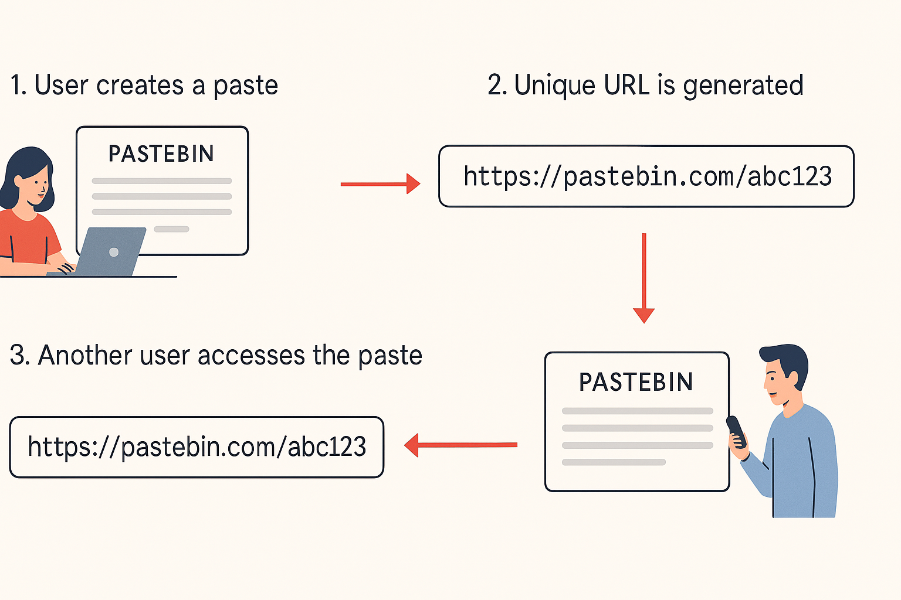

# Pastebin Service Design Summary

## What is Pastebin?
Pastebin.com-like services enable users to store plain text or images over the Internet and generate unique URLs to access the uploaded data. These services are commonly used to share data quickly by passing the URL to others.

## Requirements and Goals of the System

### Functional Requirements
- Users should upload or "paste" their data and get a unique URL to access it.
- Users will only be able to upload text.
- Data and links will automatically expire after a specific timespan; users should also specify expiration time.
- Users should optionally be able to pick a custom alias for their paste.

### Non-Functional Requirements
- The system should be highly reliable; any data uploaded should not be lost.
- The system should be highly available to ensure users can access their pastes.
- Users should be able to access their pastes in real-time with minimum latency.
- Paste links should not be guessable (not predictable).

### Extended Requirements
- Analytics, e.g., how many times a redirection happened?
- The service should also be accessible through REST APIs by other services.

## Design Considerations
- Limit on the amount of text a user can paste: maximum 10MB.
- Size limits on custom URLs for consistency.

## Capacity Estimation and Constraints
- Read-heavy service with a 100:1 read-to-write ratio.

### Traffic Estimates
- 1M new pastes per day → ~10 pastes/sec.
- 100M reads per day → ~1200 reads/sec.

### Storage Estimates
- Average paste size: 100KB.
- Daily storage: 100GB.
- 5-year storage: ~180TB (with 70% capacity model → 260TB).
- Total pastes in 5 years: ~2 billion.
- Key storage for unique IDs: ~12GB.

### Bandwidth Estimates
- Write requests: 10 pastes/sec → 1MB/s ingress.
- Read requests: 1000/sec → 100MB/s egress.

### Memory Estimates
- Cache 20% of hot pastes (80-20 rule): ~2TB.


# Pastebin Service Design Summary

## What is Pastebin?
Pastebin.com-like services enable users to store plain text or images over the Internet and generate unique URLs to access the uploaded data. These services are commonly used to share data quickly by passing the URL to others.

## Requirements and Goals of the System

### Functional Requirements
- Users should upload or "paste" their data and get a unique URL to access it.
- Users will only be able to upload text.
- Data and links will automatically expire after a specific timespan; users should also specify expiration time.
- Users should optionally be able to pick a custom alias for their paste.

### Non-Functional Requirements
- The system should be highly reliable; any data uploaded should not be lost.
- The system should be highly available to ensure users can access their pastes.
- Users should be able to access their pastes in real-time with minimum latency.
- Paste links should not be guessable (not predictable).

### Extended Requirements
- Analytics, e.g., how many times a redirection happened?
- The service should also be accessible through REST APIs by other services.

## Design Considerations
- Limit on the amount of text a user can paste: maximum 10MB.
- Size limits on custom URLs for consistency.

## Capacity Estimation and Constraints
- Read-heavy service with a 100:1 read-to-write ratio.

### Traffic Estimates
- 1M new pastes per day → ~10 pastes/sec.
- 100M reads per day → ~1200 reads/sec.

### Storage Estimates
- Average paste size: 100KB.
- Daily storage: 100GB.
- 5-year storage: ~180TB (with 70% capacity model → 260TB).
- Total pastes in 5 years: ~2 billion.
- Key storage for unique IDs: ~12GB.

### Bandwidth Estimates
- Write requests: 10 pastes/sec → 1MB/s ingress.
- Read requests: 1000/sec → 100MB/s egress.

### Memory Estimates
- Cache 20% of hot pastes (80-20 rule): ~2TB.


This is a [Next.js](https://nextjs.org) project bootstrapped with [`create-next-app`](https://nextjs.org/docs/app/api-reference/cli/create-next-app).

## Getting Started

First, run the development server:

```bash
npm run dev
# or
yarn dev
# or
pnpm dev
# or
bun dev
```

Open [http://localhost:3000](http://localhost:3000) with your browser to see the result.

You can start editing the page by modifying `app/page.tsx`. The page auto-updates as you edit the file.

This project uses [`next/font`](https://nextjs.org/docs/app/building-your-application/optimizing/fonts) to automatically optimize and load [Geist](https://vercel.com/font), a new font family for Vercel.
